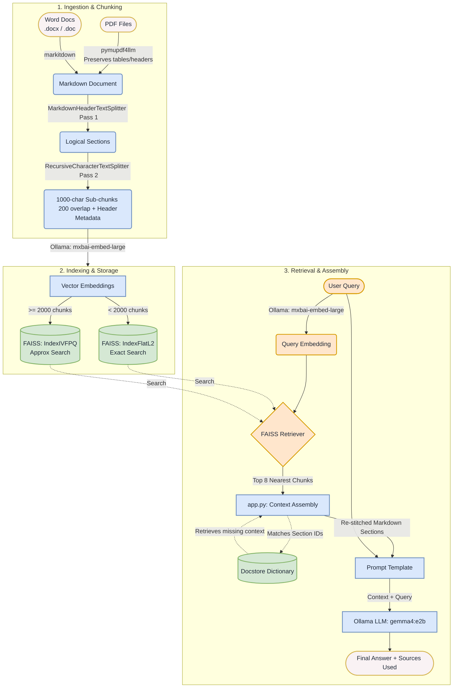

# HelpdeskRAG

A fully local, privacy-first **RAG (Retrieval-Augmented Generation)** assistant that answers questions about your own IT documentation. To use it, drop your PDFs and Word docs into a folder, build a vector index, and ask questions in plain English.

HelpdeskRAG uses [Ollama](https://ollama.com) for local LLM inference and embeddings, [FAISS](https://github.com/facebookresearch/faiss) for vector search, and [LangChain](https://www.langchain.com) to tie the retrieval pipeline together.

---

## Features

- **Runs 100% locally** — documents are embedded and queried through Ollama, so nothing is sent to an external API.
- **Ingests PDFs and Word docs** — `.pdf`, `.docx`, and `.doc` files are converted to Markdown for cleaner, more accurate parsing.
- **Header-aware chunking** — splits documents along Markdown headings first, then recursively by paragraph/sentence, preserving structure and context.
- **Section re-stitching** — at query time, retrieved chunks are reassembled into their full parent sections so the model sees complete context, not isolated fragments.
- **Scales the index automatically** — uses a flat `IndexFlatL2` for smaller document batches and switches to `IVFPQ` (work in progress) for larger ones to keep search fast and memory-friendly.
- **Source attribution** — every answer prints the document sections it was drawn from, so you can verify accuracy.
- **Built-in evaluation harness** — batch-test the system against a question/answer set and export results to CSV.

---

## How It Works

HelpdeskRAG runs in three phases: a one-time **ingestion & chunking** pass and an **indexing & storage** pass that together turn your documents into a searchable FAISS index, then a **retrieval & assembly** phase that runs every time you ask a question.



1. **Ingestion & Chunking (`ETL.py` + `chunking.py`)** — PDFs are converted to Markdown with `pymupdf4llm` (preserving tables and headers) and Word docs via `markitdown`. `chunking.py` then splits in two passes: `MarkdownHeaderTextSplitter` groups content into logical sections by heading, then `RecursiveCharacterTextSplitter` breaks those into smaller sub-chunks that carry their header metadata.
2. **Indexing & Storage (`ETL.py`)** — Each chunk is embedded with Ollama's `mxbai-embed-large` model. The FAISS index type is chosen by corpus size — `IndexFlatL2` (exact search) under 2,000 chunks and `IndexIVFPQ` (approximate search) at or above that threshold — and the store is saved to `./faiss_db`.
3. **Retrieval & Assembly (`app.py`)** — Your query is embedded with the same model and the FAISS retriever returns the nearest chunks. `app.py` re-stitches them into their full parent sections via a docstore lookup keyed on section IDs, assembles a prompt with the recovered context, and sends it to the local SLM (`gemma`) to generate the final answer plus the source sections used.

---

## Tech Stack

| Component        | Tool                                            |
| ---------------- | ----------------------------------------------- |
| LLM & embeddings | Ollama (`gemma` SLM + `mxbai-embed-large`)      |
| Vector store     | FAISS                                           |
| Orchestration    | LangChain (LCEL)                                |
| Document parsing | `pymupdf4llm`, `markitdown`                     |
| Language         | Python                                          |

---

## Project Structure

| File                  | Purpose                                                                       |
| --------------------- | ----------------------------------------------------------------------------- |
| `config.py`           | Central configuration — model names, paths, FAISS params, chunk sizes.        |
| `ETL.py`              | Ingestion pipeline: load → convert → chunk → embed → build & save FAISS index.|
| `chunking.py`         | Markdown header-aware + recursive character text splitting.                   |
| `app.py`              | Interactive Q&A loop with section re-stitching and source reporting.          |
| `test_rag.py`         | Evaluation harness; runs a Q&A set and exports results to CSV.                |
| `verify_chunking.py`  | Debug utility to inspect chunks stored in the database.                       |
| `db_cleaner.py`       | Deletes the existing FAISS index so you can rebuild from scratch.             |

---

## Prerequisites

- **Python 3.10+**
- **[Ollama](https://ollama.com/download)** installed and running locally
- The required models pulled via Ollama:

```bash
ollama pull mxbai-embed-large
ollama pull gemma4:e2b          # or whichever SLM you set in config.py
```

> **Note:** The model name in `config.py` (`SLM_MODEL`) must exactly match a model available in your local Ollama install. Update it to a model you've pulled.

---

## Installation

```bash
# Clone the repository
git clone https://github.com/cdmarian21/HelpdeskRAG.git
cd HelpdeskRAG

# Create and activate a virtual environment
python -m venv venv
source venv/bin/activate        # Windows: venv\Scripts\activate

# Install dependencies
pip install numpy faiss-cpu pymupdf4llm markitdown \
    langchain-community langchain-ollama langchain-text-splitters langchain-core
```

---

## Configuration

All tunable settings live in `config.py`:

| Setting                          | Default              | Description                                                  |
| -------------------------------- | -------------------- | ------------------------------------------------------------ |
| `PDF_DIRECTORY`                  | `./data`             | Folder containing your source documents.                     |
| `DB_PATH`                        | `./faiss_db`         | Where the FAISS index is saved.                              |
| `SLM_MODEL`                      | `gemma...`           | Ollama model used to generate answers.                      |
| `EMBEDDING_MODEL`                | `mxbai-embed-large`  | Ollama model used to embed text.                            |
| `FAISS_DIMENSION`                | `1024`               | Embedding dimension (must match the embedding model).        |
| `CHUNK_SIZE` / `CHUNK_OVERLAP`   | `1000` / `200`       | Chunk length and overlap, in characters.                     |
| `KWARGS`                         | `8`                  | Number of chunks retrieved per query.                        |
| `NLIST` / `M` / `NBITS` / `NPROB`| —                    | FAISS `IVFPQ` tuning params for larger corpora.              |

Adjust `FAISS_DIMENSION` if you change the embedding model, since it must match that model's output size.

---

## Usage

### 1. Add your documents

Place your `.pdf`, `.docx`, or `.doc` files in the `data/` directory (created automatically if missing).

### 2. Build the index

```bash
python ETL.py
```

This converts, chunks, embeds, and saves everything to `./faiss_db`. Re-run it whenever your documents change.

### 3. Ask questions

```bash
python app.py
```

```
Ask a question about your files (or type 'quit'): How do I reset a user's VPN access?

Answer:
...

Sections used:
- vpn_policy.pdf > Access Management > Resetting Credentials
```

Type `quit`, `exit`, or `q` to leave.

### Utilities

```bash
# Inspect the chunks currently stored in the database
python verify_chunking.py

# Wipe the FAISS index to rebuild from scratch
python db_cleaner.py
```

### Evaluation

`test_rag.py` runs a batch of questions through the pipeline and writes the model's answers next to the expected answers in `rag_evaluation_results.csv`. It expects a `qa_data.py` file exporting a `TEST_DATA` list:

```python
# qa_data.py
TEST_DATA = [
    {
        "question": "How do I request a new laptop?",
        "expected_answer": "Submit a hardware request ticket in the IT portal.",
    },
    # ...
]
```

Then run:

```bash
python test_rag.py
```

---

## Accuracy

HelpdeskRAG was evaluated against a fixed list of predetermined questions with known, expected answers. Each model response was scored by checking it against the documentation in two ways:

- **Manual verification** — answers were read and compared against the source documents by hand to confirm they were correct and grounded in the retrieved context.
- **Larger-model cross-checking** — answers were also reviewed using larger, more capable models as a second judge, comparing each response against the expected answer to catch errors a manual pass might miss.

Using this combined approach, the system reached a best measured accuracy of **87.8%** across the test set. Because HelpdeskRAG runs on a small local model, accuracy depends heavily on the quality of the source documents, chunking settings, and the chosen Ollama model — re-running the evaluation after tuning these is the best way to gauge changes.

---

## Notes

- `allow_dangerous_deserialization=True` is required to load the FAISS index. Only build indexes from documents you trust.
- `data/`, the FAISS index files (`*.faiss`, `*.pkl`), `.env`, and `qa_data.py` are git-ignored and stay on your machine.
- The `IVFPQ` path for large corpora (2,000+ chunks) is included but lightly tested — verify retrieval quality if you push the corpus that large.
